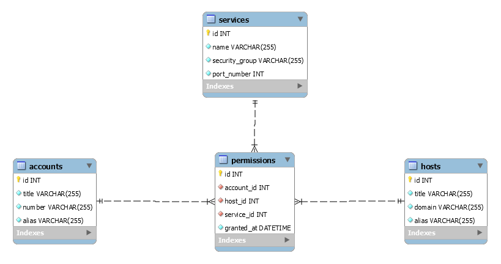

Practical test for fullstack developers
======================================

Instructions
-----------

* Fork this repository (or create your own). We suggest that the visibility of the project is set to private, so that other candidates do not have access to your project;
* Implement the test project according to the requested features;
* After finishing your test, email to [valdeci.junior@izap.com.br](mailto:valdeci.junior@izap.com.br) with the link to the repository (grant read access to the user **valdeci.junior@izap.com.br**).
* If you have any questions, please contact us at the email address [valdeci.junior@izap.com.br](mailto:valdeci.junior@izap.com.br).

Test Project
------------

Given the following ER diagram:  

Create two projects implementing the following features::

### Project 1:
* A RESTFul API just for querying the data, with filter options
* An admin backend for registering data in the database (without using the API)

There is no need to implement authentication or authorization. However, the following technologies must be used:
* Database: MySQL or PostgreSQL
* PHP 7.4 or higher
* Symfony 4.4 (or the higher LTS version)
* API Platform _(for the RESTFul API)_
* Doctrine ORM
* Easy Admin _(for the admin CRUDs)_
* Composer

### Project 2:
* A React frontend consuming the RESTFul API, for listing, filtering and viewing the data

There is no need to implement authentication or authorization. However, the following technologies must be used:
* React 16 or higher
* NPM or Yarn
* Bootstrap
